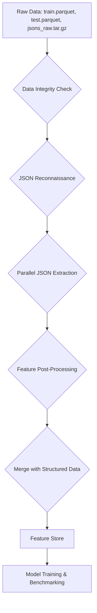

# Day 1-2 Documentation and Hand-off Report

This report summarizes the work completed during the first two days of the project and outlines the next steps for the feature engineering sprint.

## Data Flowchart



## Command Examples

Here are the commands to run the key scripts developed during this phase:

**1. Data Integrity Check:**
```bash
python run_integrity_check.py
```

**2. JSON Reconnaissance:**
```bash
python json_recon.py --sample-size 100
```

**3. JSON Feature Extraction:**
```bash
python json_extractor/json_extractor.py
```

**4. Feature Post-Processing:**
```bash
python post_process_features.py
```

**5. Merge Features:**
```bash
python merge_features.py
```

**6. Benchmark:**
```bash
python benchmark.py
```

## Memory/CPU Benchmarks

The following benchmarks were recorded on the final dataset:

*   **Timestamp:** `2025-06-20 16:51:02`
*   **Memory Usage (RSS increase after loading):** `26709.33 MB`
*   **Performance (Time for `scan` and `count`):** `0.0003 seconds`
*   **Total rows:** `18,145,372`

## Next-Step Checklist

The following tasks are planned for the upcoming feature engineering sprint:

- [ ] Add a cross-validation fold generator.
- [ ] Implement aggregation safeguards inside `feature_store.py`.
- [ ] Begin brainstorming and implementing new features.